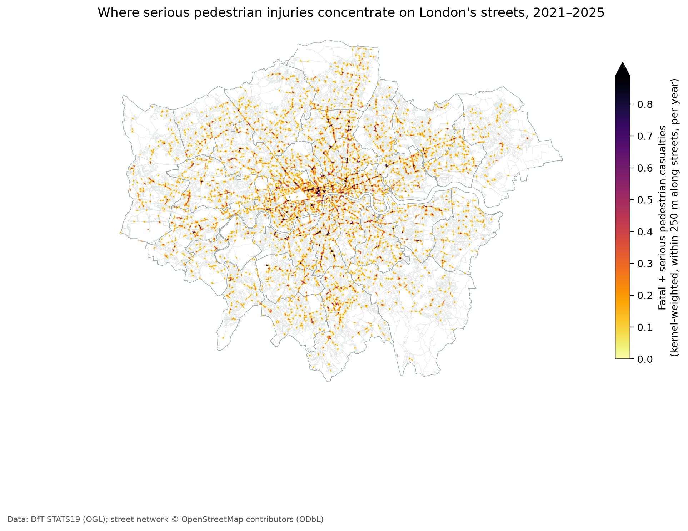
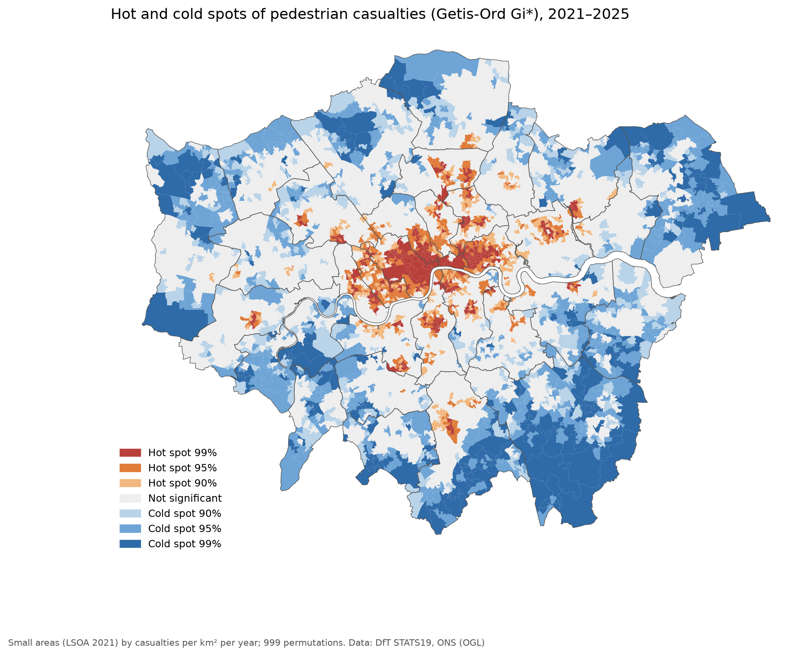
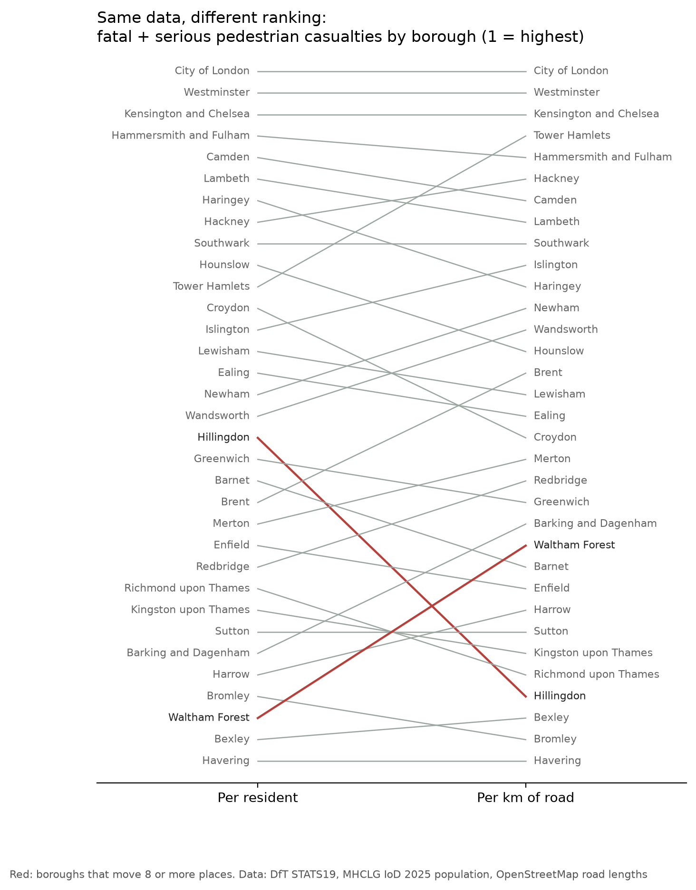

# London Pedestrian Safety

Where are pedestrians hurt on London's roads, how does the built environment relate to it, and how far are those places from emergency care?

A spatial analysis and interactive dashboard built entirely on open data and open-source tools, with a plain-English AI question-answering layer planned on top. It extends my thesis on pedestrian collisions and the built environment in Athens to London.

## Status

| Step | What | Status |
|---|---|---|
| 1 | Pedestrian casualties from DfT STATS19, cleaned and mapped | Done |
| 2 | Boundaries, population, deprivation, street network and built environment | Done |
| 3 | Hotspot analysis (network kernel density, Getis-Ord Gi*) and fair rates | Done |
| 4 | Built environment model (negative binomial, geographically weighted) | Planned |
| 5 | Access to care: network travel time to A&E and major trauma centres | Planned |
| 6 | Interactive dashboard | Planned |
| 7 | AI layer: plain-English questions answered by tested spatial queries | Planned |

## Getting started

Requires Python 3.10 or newer.

```bash
python -m venv .venv
.venv\Scripts\activate          # Windows  (macOS/Linux: source .venv/bin/activate)
pip install -r requirements.txt

python scripts/01_get_stats19.py
```

The first run downloads about 150 MB from the Department for Transport into `data/raw/` and writes results to `data/processed/`:

| File | Contents |
|---|---|
| `london_pedestrian_safety.gpkg` | `casualties` layer (one row per pedestrian casualty) and `collisions` layer (one row per collision injuring a pedestrian), British National Grid |
| `london_pedestrian_casualties.parquet` | Casualties as GeoParquet, for fast analysis |
| `london_quicklook_map.html` | Fatal and serious casualties on an interactive map |
| `columns_report.csv` | Every source column, how complete it is and example values |

Options: `--area england` or `--area gb` for a wider area, `--refresh` to re-download, `--no-download` to reuse files already downloaded.

### Step 2: context

```bash
python scripts/02_build_context.py                 # full run, including the street network
python scripts/02_build_context.py --skip-network  # quicker first run, no junction density
```

Downloads deprivation and population figures, small-area boundaries and the Greater London OpenStreetMap extract (about 120 MB), plus the drivable street network on a full run (10–20 minutes the first time, cached afterwards). Writes:

| File | Contents |
|---|---|
| `london_context.gpkg` → `lsoa` | All London small areas (LSOA 2021, about 5,000) with population, deprivation, street features, road density, junction density and casualty counts and rates |
| `london_context.gpkg` → `boroughs` | The same, summed up to the 33 boroughs |
| `london_context.gpkg` → `casualties` | Step 1 casualties plus their small area, distance to the nearest crossing, signals, bus stop, station, school, pub/bar and junction, and the type of road they happened on |
| `london_context.gpkg` → `osm_features`, `roads` | The OpenStreetMap features and roads used |
| `lsoa_variables.csv` | The small-area table without geometry, ready for modelling |

It ends with a borough ranking per resident and a first look at which small-area characteristics go together with serious pedestrian injuries.

### Step 3: hotspots and fair rates

```bash
python scripts/03_hotspots.py
```

Needs the street network from a full step 2 run. Three complementary views:

- **Street hotspots (network kernel density).** The drivable network is cut into 50 m pieces; each casualty is snapped to its street and its influence spreads along the network (quartic kernel, 250 m), so a cluster on one road does not leak onto a parallel street across a block.
- **Area hotspots (Getis-Ord Gi\*).** Small areas with significantly high or low casualty density compared with their neighbours, using 999 permutations and a false discovery rate check for multiple testing.
- **Fair rates.** Boroughs ranked per resident, per km² and per km of road, with Empirical Bayes smoothing of small-area rates so areas with few residents don't produce extreme values.

Outputs `data/processed/london_hotspots.gpkg` and the figures below, plus an interactive map in `figures/hotspots_map.html`.







## Data

| Dataset | Publisher | Licence |
|---|---|---|
| Road Safety Data (STATS19), last 5 published years | Department for Transport | Open Government Licence v3.0 |
| English Indices of Deprivation 2025 (File 7: scores, deciles, mid-2022 population) | Ministry of Housing, Communities and Local Government | Open Government Licence v3.0 |
| Lower layer Super Output Areas (December 2021) boundaries, generalised | Office for National Statistics | Open Government Licence v3.0 (contains OS data) |
| OpenStreetMap, Greater London extract and street network | OpenStreetMap contributors, via Geofabrik and OSMnx | Open Database Licence (ODbL) |

### Known limitations

- STATS19 records injury collisions reported to the police. Minor pedestrian injuries are known to be under-reported.
- Some police forces moved to injury-based severity reporting, which shifts the balance between serious and slight injuries over time. DfT provides severity-adjusted figures, kept in the data, for comparisons across years.
- A small share of records have no usable location and are excluded from mapping (the script reports how many).
- Rates per resident overstate central London, where many more people walk than live. Later steps add measures that account for footfall.
- The Index of Multiple Deprivation has included a road traffic injury indicator (in its Living Environment domain). Using it to explain pedestrian injuries is therefore slightly circular; the effect is small, but step 4 also tests the income and employment scores on their own.
- OpenStreetMap is volunteer-mapped. London's coverage is very good, but crossings and signals may be less complete in some areas.

## Tools

Python, pandas, GeoPandas, OSMnx, PySAL (libpysal, esda), SciPy, DuckDB or PostGIS (planned), MapLibre or Leaflet for the dashboard.
